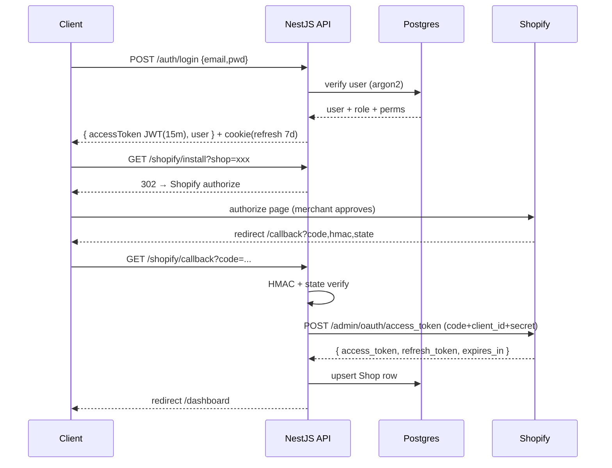
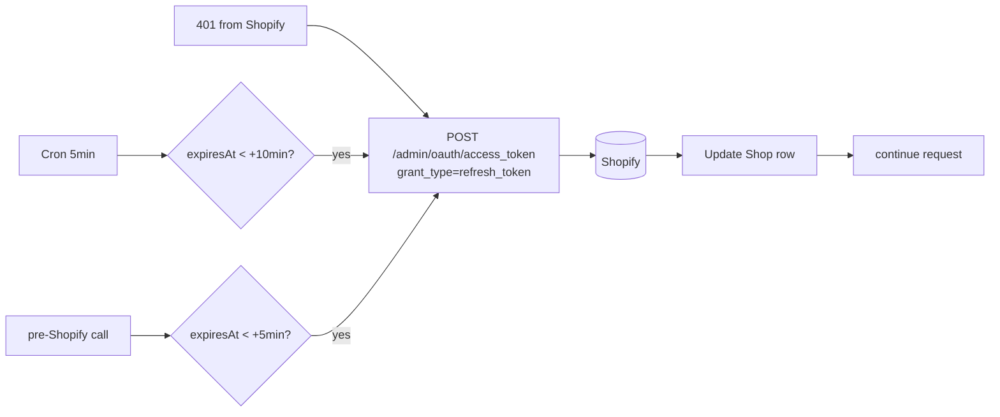
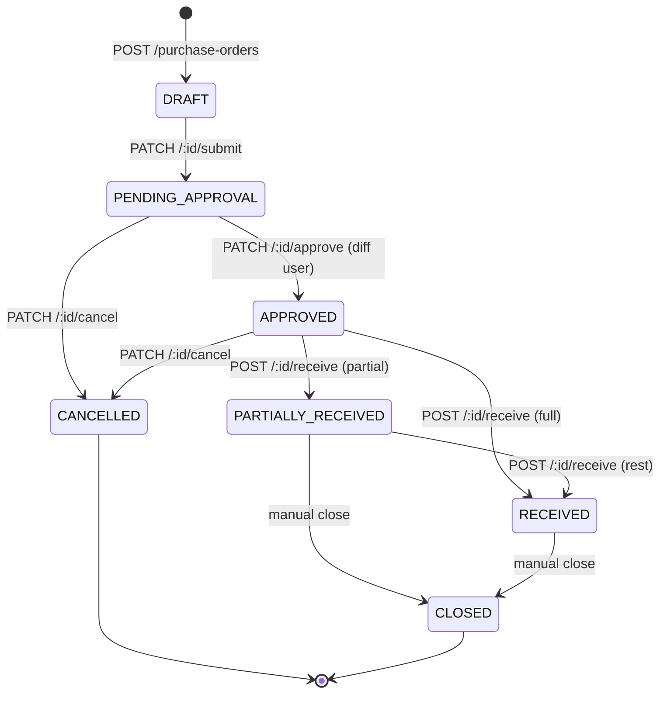
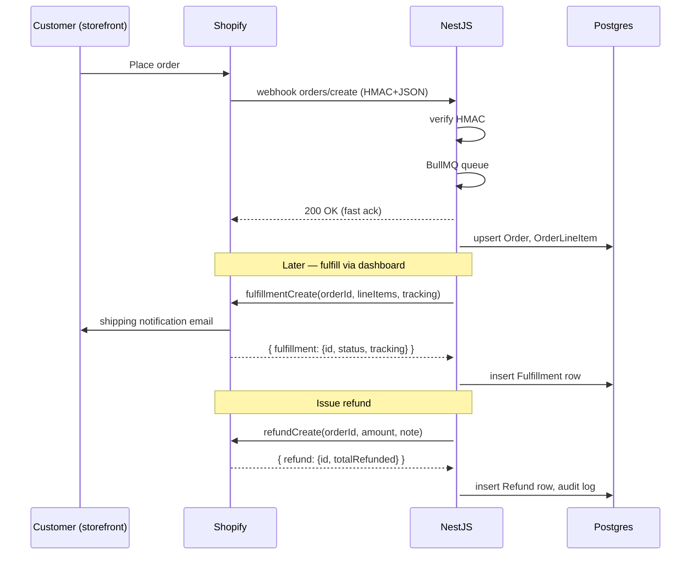
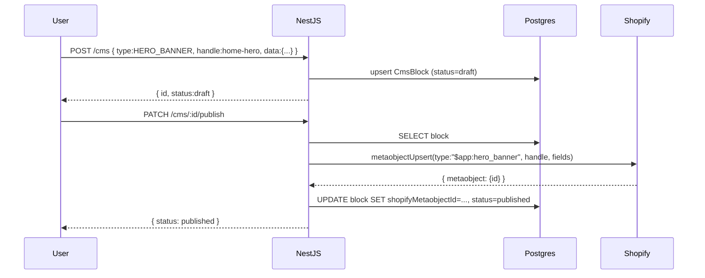
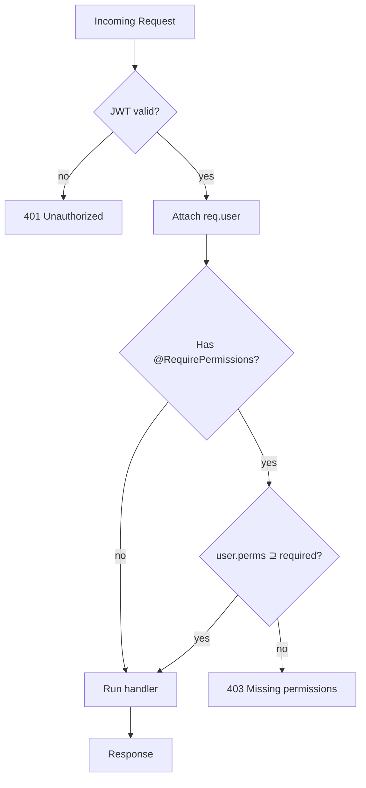
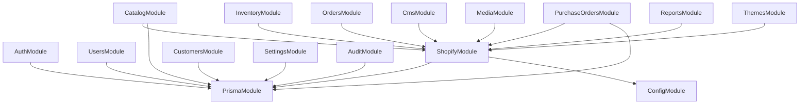

# Flow Diagrams

Visual flows for every major lifecycle. ASCII + Mermaid where helpful.

---

## 1. Login → JWT → Shopify token

```
┌────────┐                                              ┌──────────┐
│ Client │                                              │ Shopify  │
│Postman │                                              │  Admin   │
└───┬────┘                                              └─────┬────┘
    │                                                        │
    │  ① POST /api/auth/login                                │
    │  { email, password }                                   │
    ├────────────────────────► ┌────────────┐                │
    │                          │   NestJS   │                │
    │                          │            │                │
    │                          │ • argon2   │                │
    │                          │   verify   │                │
    │                          │ • read     │                │
    │                          │   role+    │                │
    │                          │   perms    │                │
    │                          │ • sign     │                │
    │                          │   JWT(15m) │                │
    │                          └─────┬──────┘                │
    │  ② { accessToken, user }       │                       │
    │ ◄──────────────────────────────┘                       │
    │  Set-Cookie: refresh_token (7d)                        │
    │                                                        │
    │  ③ Future calls:                                       │
    │  Authorization: Bearer <JWT>                           │
    │                                                        │
    │  ④ POST /api/shopify/install?shop=xxx.myshopify.com    │
    ├────────────────────────► ┌────────────┐                │
    │                          │  redirect  │                │
    │  ⑤ 302 → Shopify         │  to auth   │                │
    │ ◄────────────────────────┤  + nonce   │                │
    │                          │  in cookie │                │
    │                          └────────────┘                │
    │  ⑥ Browser → Shopify                                   │
    ├───────────────────────────────────────────────────────►│
    │                                                        │
    │  ⑦ Merchant approves scopes                            │
    │                                                        │
    │  ⑧ Shopify redirects ← code, hmac, state               │
    │ ◄──────────────────────────────────────────────────────┤
    │                                                        │
    │  ⑨ GET /api/shopify/callback?code=...                  │
    ├────────────────────────► ┌────────────┐                │
    │                          │ HMAC verify│                │
    │                          │ State check│                │
    │                          │            │                │
    │                          │ POST       │  ⑩ exchange    │
    │                          │ /admin/    ├───────────────►│
    │                          │ oauth/     │                │
    │                          │ access_    │  ⑪ access_     │
    │                          │ token      │ ◄──────────────┤
    │                          │            │     token +    │
    │                          │ Save to    │     refresh    │
    │                          │ Shop table │     token      │
    │                          └─────┬──────┘                │
    │  ⑫ redirect /dashboard         │                       │
    │ ◄──────────────────────────────┘                       │
```



---

## 2. Token auto-refresh lifecycle

```
       ┌──────────────────────────────────────────────┐
       │            Shop row in Postgres              │
       │  domain, accessToken, refreshToken,          │
       │  expiresAt, refreshExpiresAt                 │
       └────────────────────┬─────────────────────────┘
                            │
            ┌───────────────┼─────────────────────┐
            │               │                     │
            ▼               ▼                     ▼
     ┌────────────┐  ┌─────────────┐      ┌────────────┐
     │   Cron     │  │ pre-call    │      │ on 401     │
     │ every 5min │  │ (getActive) │      │ retry      │
     │            │  │             │      │            │
     │ refresh if │  │ refresh if  │      │ refresh +  │
     │ expires    │  │ expires     │      │ retry once │
     │ <=10 min   │  │ <=5 min     │      │            │
     └──────┬─────┘  └──────┬──────┘      └──────┬─────┘
            │               │                     │
            └───────┬───────┴─────────────────────┘
                    ▼
         POST https://<shop>/admin/oauth/access_token
         { grant_type:"refresh_token", refresh_token, client_id, client_secret }
                    │
                    ▼
              new access_token + new refresh_token + expires_in
                    │
                    ▼
            UPDATE Shop SET accessToken=..., refreshToken=..., expiresAt=...
```



---

## 3. Product create + sync

```
┌────────┐                  ┌────────────┐                  ┌─────────┐
│ Client │                  │   NestJS   │                  │ Shopify │
└───┬────┘                  └─────┬──────┘                  └────┬────┘
    │                             │                              │
    │ POST /api/products          │                              │
    │ {title, status, tags}       │                              │
    ├────────────────────────────►│                              │
    │                             │  productCreate mutation      │
    │                             ├─────────────────────────────►│
    │                             │                              │
    │                             │  {product:{id,title,...}}    │
    │                             │ ◄────────────────────────────┤
    │                             │                              │
    │                             │  (NOT written to Postgres)   │
    │ {gid, title, ...}           │                              │
    │ ◄───────────────────────────┤                              │
    │                             │                              │
    │ GET /api/products           │                              │
    │ (immediately after)         │                              │
    ├────────────────────────────►│                              │
    │                             │  SELECT FROM Product (empty) │
    │ {total:0, items:[]}         │  (mirror not populated!)     │
    │ ◄───────────────────────────┤                              │
    │                             │                              │
    │ POST /api/products/sync     │                              │
    ├────────────────────────────►│                              │
    │                             │  GraphQL products(first:100) │
    │                             ├─────────────────────────────►│
    │                             │     cursor pagination        │
    │                             │ ◄════════════════════════════┤
    │                             │  upsert into Product table   │
    │                             │                              │
    │ {ok:true}                   │                              │
    │ ◄───────────────────────────┤                              │
    │                             │                              │
    │ GET /api/products           │                              │
    ├────────────────────────────►│                              │
    │                             │  SELECT FROM Product (full)  │
    │ {total:21, items:[...]}     │                              │
    │ ◄───────────────────────────┤                              │
```

> Real production: webhook `products/create` auto-syncs without manual sync call (needs Redis).

---

## 4. Purchase Order full lifecycle



### Receive transaction detail

```
POST /purchase-orders/<id>/receive { items: [{poItemId, quantity}] }
        │
        ▼
┌──────────────────────────────────────────────────────────┐
│           BEGIN TX                                       │
│                                                          │
│  1. SELECT po + items, check status APPROVED/PARTIAL     │
│  2. validate: quantity <= orderedQty - receivedQty       │
│                                                          │
│  3. INSERT GoodsReceipt(grNumber=GR-2026-NNNNN)          │
│        + GoodsReceiptItem rows                           │
│                                                          │
│  4. UPDATE PurchaseOrderItem                             │
│        SET receivedQty = receivedQty + quantity          │
│                                                          │
│  5. INSERT InventoryAdjustment                           │
│        (audit row: who, when, reason='po_received',      │
│         reference=grNumber)                              │
│                                                          │
│  6. CALL Shopify inventorySetQuantities mutation         │
│                                                          │
│  7. Re-evaluate PO status:                               │
│     all items.receivedQty >= orderedQty? → RECEIVED      │
│     some items.receivedQty > 0?         → PARTIALLY_R    │
│                                                          │
│           COMMIT TX                                      │
└──────────────────────────────────────────────────────────┘
```

---

## 5. Order → Fulfillment → Refund



---

## 6. Inventory adjustment flow

```
                       ┌──────────────────────┐
                       │ POST /inventory/     │
                       │      adjust          │
                       │ {itemId, locId,      │
                       │  delta, reason}      │
                       └──────────┬───────────┘
                                  │
                ┌─────────────────┼─────────────────┐
                │                 │                 │
                ▼                 ▼                 ▼
       ┌────────────────┐ ┌────────────┐  ┌────────────────┐
       │ INSERT         │ │ Call       │  │ Wait for       │
       │ Inventory      │ │ Shopify    │  │ Shopify        │
       │ Adjustment     │ │ inventory- │  │ webhook        │
       │ (audit row)    │ │ SetQty     │  │ inventory_     │
       │                │ │ mutation   │  │ levels/update  │
       └────────────────┘ └─────┬──────┘  └────────┬───────┘
                                │                  │
                                ▼                  ▼
                         Shopify updates    Mirror updates
                         inventory level    InventoryLevel
                         on storefront      row
```

---

## 7. CMS publish (local → Shopify Metaobject)



---

## 8. Webhook ingestion

```
Shopify (event happens)
       │
       │  POST https://<your-api>/api/webhooks/shopify/<topic-with-dash>
       │  Headers: X-Shopify-Hmac-Sha256, X-Shopify-Topic, X-Shopify-Shop-Domain
       │  Body: raw JSON
       ▼
┌────────────────────────────────────────────────┐
│ WebhookController                              │
│   1. read raw body buffer                      │
│   2. computed = HMAC-SHA256(rawBody, secret)   │
│   3. if computed !== header → 400              │
│   4. queue.add(topic, payload, retries:8)      │
│   5. return 200 immediately                    │
└──────────────────┬─────────────────────────────┘
                   │  via Redis (BullMQ)
                   ▼
┌────────────────────────────────────────────────┐
│ WebhookProcessor (worker)                      │
│   switch(topic):                               │
│     orders/create     → upsert Order           │
│     products/update   → upsert Product         │
│     customers/update  → upsert Customer        │
│     inventory_levels/update → update mirror    │
│     app/uninstalled   → wipe shop tokens       │
│     customers/redact  → GDPR delete            │
│     customers/data_request → GDPR export       │
│                                                │
│   on error → exp backoff, attempts++, max 8    │
│   max attempts → status DEAD, alert Slack      │
└────────────────────────────────────────────────┘
```

---

## 9. RBAC check on every request

```
Request → JwtAuthGuard → PermissionsGuard → Handler
            │                  │
            │                  └─ reads @RequirePermissions metadata
            │                     reads JWT user.perms
            │                     intersect; if missing → 403
            │
            └─ verifies JWT signature + exp
               attaches req.user = { sub, email, roleId, perms[] }
```



---

## 10. Full end-to-end chain (one product → sold → refunded)

```mermaid
flowchart LR
  start([Start]) --> login[① Login → JWT]
  login --> connect[② Connect Shopify<br/>shop token in DB]
  connect --> create[③ POST /products<br/>productCreate]
  create --> sync[④ POST /products/sync<br/>mirror populated]
  sync --> vendor[⑤ Create vendor]
  vendor --> po[⑥ Create PO DRAFT]
  po --> submit[⑦ Submit → PENDING]
  submit --> approve[⑧ Approve diff user → APPROVED]
  approve --> receive[⑨ Receive goods<br/>inventory ↑]
  receive --> publish[⑩ Publish product ACTIVE]
  publish --> customer((Customer<br/>places order))
  customer --> webhook[⑪ webhook orders/create]
  webhook --> mirror[⑫ Order in DB]
  mirror --> fulfill[⑬ POST /orders/:id/fulfill<br/>tracking]
  fulfill --> ship[Customer notified]
  ship --> refund{Refund?}
  refund -- yes --> refundC[⑭ POST /orders/:id/refund]
  refundC --> audit[⑮ AuditLog full trail]
  refund -- no --> audit
  audit --> done([End])
```



---

## Module dependency graph



---

## Token states — single timeline

```
T+0           T+50min       T+55min     T+58min      T+60min
 │              │             │           │            │
 ▼              ▼             ▼           ▼            ▼
issued        cron fires    pre-call    pre-call     EXPIRY
expiresAt=60  no action     no action   REFRESH      (would 401
              (>10min)      (>5min)     (≤5min)     if not refreshed)

After refresh at T+58 → new expiresAt = T+58 + 60 = T+118min
Continuous loop. Token never seen as expired by callers.
```

---

_Last updated: 2026-06-10_
